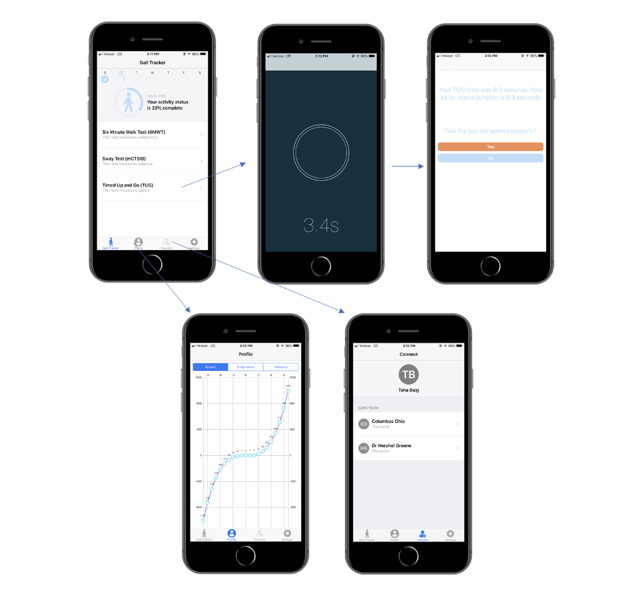

## About
Talaris Health is a software platform that leverages gait analytics to facilitate enhanced chronic care management in the hydrocephalus patient population. The app consists of three clinically validated gait tests used in clinic to monitor condition. The patient conducts these tests at home, and the data gathered by smartphone sensors is processed and sent in the form of quantitative insights to the clinician.

## Screenshots

